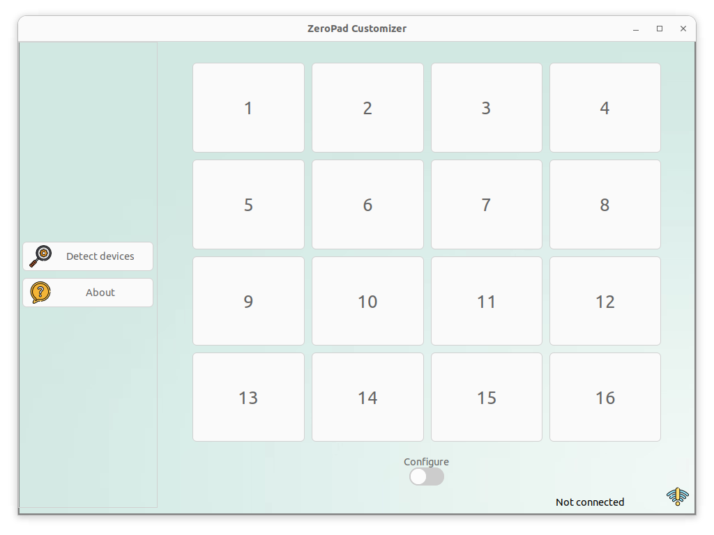

<!-- Improved compatibility of back to top link: See: https://github.com/bmcsilva/zeropad-customizer-app/pull/73 -->
<a name="readme-top"></a>
<!--
*** Thanks for checking out the zeropad-customizer-app. If you have a suggestion
*** that would make this better, please fork the repo and create a pull request
*** or simply open an issue with the tag "enhancement".
*** Don't forget to give the project a star!
*** Thanks again! Now go create something AMAZING! :D
-->


<!-- PROJECT SHIELDS -->
<!--
*** I'm using markdown "reference style" links for readability.
*** Reference links are enclosed in brackets [ ] instead of parentheses ( ).
*** See the bottom of this document for the declaration of the reference variables
*** for contributors-url, forks-url, etc. This is an optional, concise syntax you may use.
*** https://www.markdownguide.org/basic-syntax/#reference-style-links
-->
[![Stargazers][stars-shield]][stars-url]
[![Issues][issues-shield]][issues-url]
[![LinkedIn][linkedin-shield]][linkedin-url]
<br />

  
<!--- 
         

<!-- PROJECT LOGO -->
<br />
<div align="center">
  <a href="https://github.com/bmcsilva/zeropad-customizer-app/assets/logo.png">
    
  </a>

<h3 align="center">ZeroPad Customizer: A free program that allows us to configure a PIM551 keypad and a Raspberry Pi Pico W to execute keybinds on our computer</h3>

  <p align="center">
    <a href="https://github.com/bmcsilva/zeropad-customizer-app/issues">Report Bug</a>
    ·
    <a href="https://github.com/bmcsilva/zeropad-customizer-app/issues">Request Feature</a>
  </p>
</div>


<!-- TABLE OF CONTENTS -->
<details>
  <summary>Table of Contents</summary>
  <ol>
    <li>
      <a href="#about-the-project">About The Project</a>
      <ul>
        <li><a href="#built-with">Built With</a></li>
      </ul>
    </li>
    <li>
      <a href="#getting-started">Getting Started</a>
      <ul>
        <li><a href="#prerequisites">Prerequisites</a></li>
        <li><a href="#installation">Installation</a></li>
      </ul>
    </li>
    <li><a href="#todo-list">Todo list</a></li>
    <li><a href="#contact">Contact</a></li>
  </ol>
</details>


<!-- ABOUT THE PROJECT -->
## About The Project

<a href="https://github.com/bmcsilva/zeropad-customizer-app/assets/screen_1.png">
    
</a>

This project was born out of my aspiration to showcase my coding abilities. The initial concept was to create a keypad capable of simulating keypresses on a connected device, such as my PC. As I explored similar projects, I came across numerous individuals building their own 'stream decks,' and I thought to myself, 'I can do this too.' And so, I set out to prove just that.

I embarked on this journey, leveraging Python examples from the CircuitPython libraries to bring my vision to life. This project consisted of two essential components:

* Developing the necessary code for the Raspberry Pi to execute the desired functions.
* Creating a PC program that would enable me to customize the keypad's colors and key bindings to my liking.

The Configurator app was easy to create, thanks to my proficiency in C and GTK, which are like my comfort zone. However, the python part posed a challenge because I had never coded in that language before.

<p align="right">(<a href="#readme-top">back to top</a>)</p>


### Built With
<a href="">
    
</a>

<a href="https://www.gtk.org/">
    
</a>
<a href="https://www.sqlite.org/index.html">
      
</a>
<a href="https://circuitpython.org/">
      
</a>

All the assetts (images, backgrounds, etc...) are made by Freepik can be found on [their website](https://www.freepik.com/)
<br />
<a href="https://www.freepik.com/">
      
</a>

  
<!-- GETTING STARTED -->
## Getting Started

### Prerequisites

For this work you need a computer with 
* Windows 7 or above
* Ubuntu 20.04 or above

### Installation

1. Get a free API Key at [https://example.com](https://example.com)
2. Clone the repo
   ```sh
   git clone https://github.com/bmcsilva/zeropad-customizer-app.git
   ```
3. Install NPM packages
   ```sh
   npm install
   ```
4. Enter your API in `config.js`
   ```js
   const API_KEY = 'ENTER YOUR API';
   ```

<p align="right">(<a href="#readme-top">back to top</a>)</p>

<!-- TODO LIST -->
## Todo list

- [ ] Create an "About" window.
- [ ] Enable customization of button names (e.g., "Mute Microphone," "Run Excel," etc.).
- [ ] Implement the ability to select new effects.
- [ ] Enable button backlighting, with color changes upon pressing.
- [ ] Allow the use of Windows CMD or Ubuntu Terminal to execute custom user-defined commands (e.g., open an app, etc.).
- [ ] Implement the capability to send HTTP requests to a specified target (e.g., send a POST command to turn off a light).
- [ ] Add support for multiple pages within the application.
- [ ] Implement the ability to export and import presets.
- [ ] Enable the export and import of a database.
<!-- - [x] Add Changelog -->

See the [open issues](https://github.com/bmcsilva/zeropad-customizer-app/issues) for a full list of proposed features (and known issues).

<p align="right">(<a href="#readme-top">back to top</a>)</p>


<!-- CONTACT -->
## Contact

<a href="https://linkedin.com/in/bruno-m-c-silva" target="blank"></a>
<a href="https://discord.com/users/513401442267037714" target="blank"></a>

<p align="right">(<a href="#readme-top">back to top</a>)</p>

<!-- MARKDOWN LINKS & IMAGES -->
<!-- https://www.markdownguide.org/basic-syntax/#reference-style-links -->
[stars-shield]: https://img.shields.io/github/stars/bmcsilva/zeropad-customizer-app.svg?style=for-the-badge
[stars-url]: https://github.com/bmcsilva/zeropad-customizer-app/stargazers
[issues-shield]: https://img.shields.io/github/issues/bmcsilva/zeropad-customizer-app.svg?style=for-the-badge
[issues-url]: https://github.com/bmcsilva/zeropad-customizer-app/issues
[linkedin-shield]: https://img.shields.io/badge/-LinkedIn-black.svg?style=for-the-badge&logo=linkedin&colorB=555
[linkedin-url]: https://linkedin.com/in/bmcsilva
[version-shield]: https://img.shields.io/badge/Version-0.0.1-blue
[version-url]: https://img.shields.io/badge/Version-0.0.1-blue
