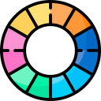

<!-- Improved compatibility of back to top link: See: https://github.com/bmcsilva/zeropad-customizer-app/pull/73 -->

<!--
*** Thanks for checking out the zeropad-customizer-app. If you have a suggestion
*** that would make this better, please fork the repo and create a pull request
*** or simply open an issue with the tag "enhancement".
*** Don't forget to give the project a star!
*** Thanks again! Now go create something AMAZING! :D
-->

<!-- PROJECT SHIELDS -->
<!--
*** I'm using markdown "reference style" links for readability.
*** Reference links are enclosed in brackets [ ] instead of parentheses ( ).
*** See the bottom of this document for the declaration of the reference variables
*** for contributors-url, forks-url, etc. This is an optional, concise syntax you may use.
*** https://www.markdownguide.org/basic-syntax/#reference-style-links
-->

         
         
         
          
         
           
         
         

<!-- PROJECT LOGO -->
 

  

<h3 align="center">ZeroPad Customizer: A free program that allows us to configure a PIM551 keypad and a Raspberry Pi Pico W to execute keybinds on our computer</h3>

  

    <a href="https://github.com/bmcsilva/zeropad-customizer-app/issues">Report Bug</a>
    ·
    <a href="https://github.com/bmcsilva/zeropad-customizer-app/issues">Request Feature</a>
  

<!-- TABLE OF CONTENTS -->

  
Table of Contents

  <ol>
    <li>
      <a href="#about-the-project">About The Project</a>
      <ul>
        <li><a href="#built-with">Built With</a></li>
      </ul>
    </li>
    <li>
      <a href="#getting-started">Getting Started</a>
      <ul>
        <li><a href="#prerequisites">Prerequisites</a></li>
        <li><a href="#installation">Installation</a></li>
      </ul>
    </li>
    <li><a href="#todo-list">Todo list</a></li>
    <li><a href="#contact">Contact</a></li>
  </ol>

<!-- ABOUT THE PROJECT -->
## About The Project

 

This project was born out of my aspiration to showcase my coding abilities. The initial concept was to create a keypad capable of simulating keypresses on a connected device, such as my PC. As I explored similar projects, I came across numerous individuals building their own 'stream decks,' and I thought to myself, 'I can do this too.' And so, I set out to prove just that.

I embarked on this journey, leveraging Python examples from the CircuitPython libraries to bring my vision to life. This project consisted of two essential components:

* Developing the necessary code for the Raspberry Pi to execute the desired functions.
* Creating a PC program that would enable me to customize the keypad's colors and key bindings to my liking.

The Configurator app was easy to create, thanks to my proficiency in C and GTK, which are like my comfort zone. However, the python part posed a challenge because I had never coded in that language before.

 
Here's a glimpse of the application:
 

 

    
<i>After the first boot of the application</i>

    

 

    
<i>A sample of some customized buttons</i>

    

(<a href="#readme-top">back to top</a>)

### Built With

 

         
All the assetts (images, backgrounds, etc...) are made by Freepik can be found on <a href="https://www.freepik.com/">their website</a>

         

  
<!-- GETTING STARTED -->
## Getting Started

### Prerequisites

This application is compatible with the following operating systems
* Windows 7 or later
* Ubuntu 20.04 or later
* 

    
A Raspberry Pi Pico W (At this date, this will <b>not work on non W devices</b>)

    
     
* 

    
A Pico RGB Keypad Base (PIM551) 

    
     

* An accessible WiFi connection to reach the host (needed for the Raspberry)

### Installation
<b>Warning:</b> this will wipe your device. If you have stuff inside, do a backup now.

0. Required files on the releases:
    - Download the ZeroPad-Customizer-raspberry-v0.0.1.zip
    - Download the ZeroPad-Customizer for your Operating System

1. Wipe the entire Raspberry
    - Remove the USB cord from the raspberry
    - Press the white button on the raspberry (<b><i>BOOOTSEL</b></i>)
    - Download this file https://datasheets.raspberrypi.com/soft/flash_nuke.uf2
    - Copy the file into inside the raspberry
    - Wait for the raspberry to boot
    
2. Setup the Raspberry Pi Pico W.
   - Download the "latest stable release of CircuitPython" https://circuitpython.org/board/raspberry_pi_pico_w/
   - Copy the file into inside the raspberry
   - Wait for the raspberry to boot

3. After it boots, go to the ZeroPad-Customizer-raspberry-v0.0.1.zip, and unzip it.
4. Copy the content, and place it inside the raspberry

5. Edit the file <i><b>"network.cfg"</b></i> and change the <i><b><your_ssid></b></i> and <i><b><your_password></b></i> to the WiFi network of your desire, and then save.
 - 5.1 If you dont want to create said file, you can skip this step, and when you reach the <b>#9</b>, come back again here, because, on the first boot, the raspberry will start on AP_Mode. 
    Also, after, if the network you selected isnt reachable, it will also make the raspberry start in AP Mode:
    - 5.1.1 Connect to the network called "ZeroPad-RPI" and insert the password "1234567890"
    - 5.1.2 Type this on your browser http://192.168.1.4/rpi/?ssid=<YOUR_SSID>&pwd=<PASSWORD> and press send
    - 5.1.3 On the browser you are going to see a message. If it's OK, just unplug the Raspberry, and plug it again, else, check what you have typed.
        - Note: You can use the command in any time. Just be aware that, any command sent, will need a unplug/plug of the raspberry
        - Theres also the command http://picow/rpi/?whoami=1, that responds with the raspberry address. If for some reason your app is not communicating, try this command.
6. Copy the file <i><b>"network.cfg"</b></i> to the raspberry
7. Copy the files <i><b>"code.py"</b></i> and <i><b>"boot.py"</b></i> to the Raspberry 
8. Unplug the Raspberry
9. Plug the raspberry<del>, and wait for the keys turn off</del>
10. Start the ZeroPad Customizer app
11. Thats it. Ready to go!

(<a href="#readme-top">back to top</a>)

<!-- TODO LIST -->
## Todo list

- [ ] Create an "About" window.
- [ ] Enable customization of button names (e.g., "Mute Microphone," "Run Excel," etc.).
- [ ] Implement the ability to select new effects.
- [ ] Enable button backlighting, with color changes upon pressing.
- [ ] Allow the use of Windows CMD or Ubuntu Terminal to execute custom user-defined commands (e.g., open an app, etc.).
- [ ] Implement the capability to send HTTP requests to a specified target (e.g., send a POST command to turn off a light).
- [ ] Add support for multiple pages within the application.
- [ ] Implement the ability to export and import presets.
- [ ] Enable the export and import of a database.
- [ ] Make it work on non "W" devices
<!-- - [x] Add Changelog -->

See the [open issues](https://github.com/bmcsilva/zeropad-customizer-app/issues) for a full list of proposed features (and known issues).

(<a href="#readme-top">back to top</a>)

<!-- CONTACT -->
## Contact

(<a href="#readme-top">back to top</a>)

